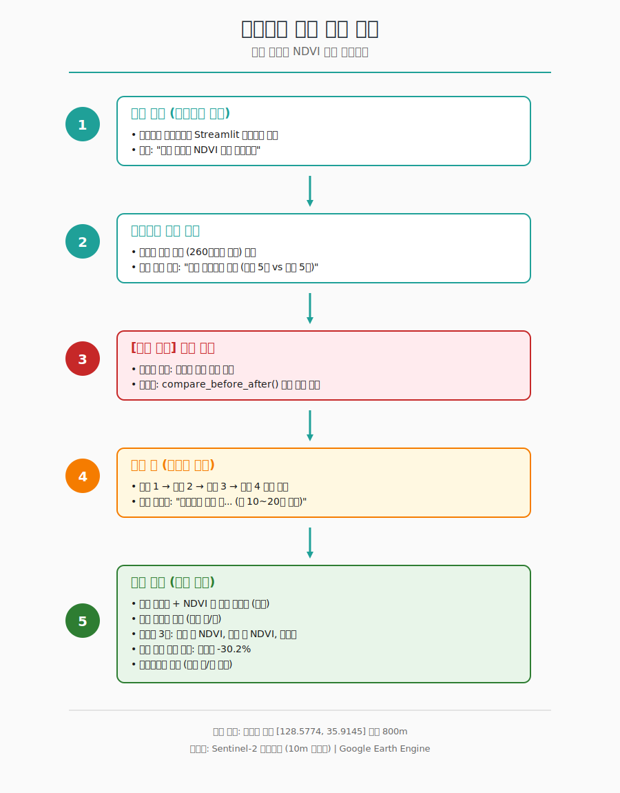

# 🖥️ 화면 흐름 설계

## 대구 함지산 NDVI 분석 대시보드

| 항목 | 내용 |
|------|------|
| **작성자** | 최경민 (학번: 2022114376) |
| **소속** | 경북대학교 위치정보시스템학과 |
| **문서 종류** | UI/UX 설계 문서 |

---

## 1. 화면 흐름도



> 💡 위 이미지는 SVG 형식으로 제공됩니다. GitHub에서는 자동으로 렌더링됩니다.

---

## 2. 단계별 상세 설명

### 🚀 Step 1: 시작 화면

| 항목 | 내용 |
|------|------|
| **트리거** | 사용자가 브라우저로 대시보드 URL 접속 |
| **표시 내용** | 대시보드 제목, 헤더, 캡션 |
| **사용자 액션** | 화면 확인 후 아래로 스크롤 |

---

### 📍 Step 2: 프로젝트 정보 확인

| 항목 | 내용 |
|------|------|
| **표시 내용** | 함지산 산불 개요, 분석 방법 안내 |
| **시각 요소** | 마크다운 텍스트 + 정보 박스(`st.info`) |
| **사용자 액션** | 내용 읽고 분석 시작 버튼으로 이동 |

**표시 정보**

- 📌 **산불 발생 정보**: 2025년 4월 28일, 함지산 북구, 약 260헥타르 피해
- 🔎 **분석 방법**: 같은 계절끼리 비교 (작년 5월 vs 올해 5월)
- 💡 **분석 의의**: 계절 효과를 제거하고 순수 산불 영향만 측정

---

### 🔴 Step 3: 분석 시작 버튼 클릭 ⭐

| 항목 | 내용 |
|------|------|
| **사용자 액션** | 빨간색 메인 버튼 "분석 시작" 클릭 |
| **트리거 함수** | `compare_before_after()` 메인 함수 호출 |
| **백엔드 처리** | 함수 1 → 함수 2 → 함수 3 → 함수 4 순차 실행 |

---

### ⏳ Step 4: 분석 중 (백엔드 처리)

| 항목 | 내용 |
|------|------|
| **로딩 표시** | 스피너 + 메시지 "위성영상 분석 중... (약 10~20초 소요)" |
| **실행 순서** | 산불 전 영상 → NDVI 계산 → 평균 추출 → 동일하게 산불 후 처리 → 변화율 계산 |
| **결과 저장** | 딕셔너리 형태로 8개 정보 반환 |

---

### 📊 Step 5: 결과 화면 (성공 표시)

#### 5-1. 완료 메시지 + 해석 가이드

- ✅ 성공 메시지 표시
- 📖 **NDVI 값 해석 가이드** (펼침 메뉴, `st.expander`)

| NDVI 값 | 의미 |
|---------|------|
| 0.6 ~ 0.9 | 🌲 건강한 식생 (울창한 숲) |
| 0.2 ~ 0.5 | 🌱 잔디, 농작물 |
| 0 근처 | 🏙️ 맨땅, 도시 |
| 음수 | 💧 물, 눈, 구름 |

#### 5-2. 영상 촬영일 표시

- 📅 산불 전 영상: 2024-05-03
- 📅 산불 후 영상: 2025-05-08

#### 5-3. 핵심 메트릭 (3개 컬럼)

| 메트릭 | 값 | 의미 |
|--------|-----|------|
| **산불 전 NDVI** | 0.693 | 기준 시점 |
| **산불 후 NDVI** | 0.484 | -30.2% (변화율) |
| **변화량** | -0.209 | 식생 감소 |

#### 5-4. 핵심 결과 강조 박스

- 🚨 변화율이 음수이면 빨간색 에러 박스로 강조
- 💡 결과 해석 텍스트 표시

#### 5-5. 인터랙티브 지도 시각화 🗺️

| 항목 | 내용 |
|------|------|
| **지도 라이브러리** | `geemap.foliumap` |
| **중심 좌표** | [35.9145, 128.5774] (함지산) |
| **줌 레벨** | 14 |
| **레이어** | 산불 전 NDVI, 산불 후 NDVI, 분석 영역 (빨간 원) |
| **인터랙션** | 우측 상단 레이어 아이콘으로 산불 전/후 토글 가능 |

**색상 팔레트**

```
NDVI 0.0 → 흰색 (식생 없음)
NDVI 0.2 → 노랑 (식생 적음)
NDVI 0.5 → 연두 (보통 식생)
NDVI 0.8 → 진초록 (건강한 식생)
NDVI 1.0 → 짙은 진초록 (매우 풍부)
```

#### 5-6. 상세 분석 데이터 (펼침)

- 분석 영역 정보
- 사용 영상 날짜
- NDVI 값 (소수점 4자리)
- 계산 공식
- 데이터 출처

---

## 3. 사용자 시나리오

### 🎬 일반 사용자 시나리오

1. 사용자가 브라우저로 대시보드 URL에 접속
2. 함지산 산불 정보와 분석 방법을 읽음
3. **"분석 시작"** 버튼을 클릭
4. 위성영상이 자동으로 불러와짐 (약 15초 소요)
5. NDVI 메트릭과 변화율(-30.2%) 확인
6. 지도에서 산불 전/후를 토글로 비교
7. 상세 분석 데이터 확인 (선택 사항)

---

## 4. 디자인 원칙

1. **명확한 단방향 흐름**
   - 위에서 아래로 자연스러운 스크롤 구조

2. **즉각적인 피드백**
   - 로딩 스피너로 처리 중임을 알림
   - 성공 메시지로 완료 알림

3. **점진적 정보 공개**
   - 핵심 메트릭 우선 표시
   - 상세 데이터는 펼침 메뉴로 제공

4. **시각적 강조**
   - 변화율 음수는 빨간색 박스로 강조
   - 핵심 결과는 큰 폰트 + 색상으로 강조

5. **인터랙티브 요소**
   - 지도 토글로 직접 비교
   - 상세 데이터 펼침/접힘

---

## 5. 향후 확장 계획

### 🚀 범용 대시보드 확장 시 추가될 화면

원래 구상했던 범용 도구로 발전시킬 경우, 다음 화면이 추가될 예정:

```
[입력 화면] (신규 추가)
   ↓
지역 선택 (지도 클릭 또는 좌표 입력)
   ↓
시기 선택 (사건일, 산불 전/후 시기 위젯)
   ↓
입력 검증 (계절 일치, 날짜 순서 등)
   ↓
[기존 흐름 진행]
```

### 📦 추가될 위젯

- 📍 지도 클릭 위젯 (`streamlit-folium`)
- 📅 날짜 선택 위젯 (`st.date_input`)
- ⚠️ 입력 검증 경고 (`st.warning`, `st.error`)
- 💡 권장 시기 자동 추천

---

> 📌 작성일: 2026년 5월 26일
